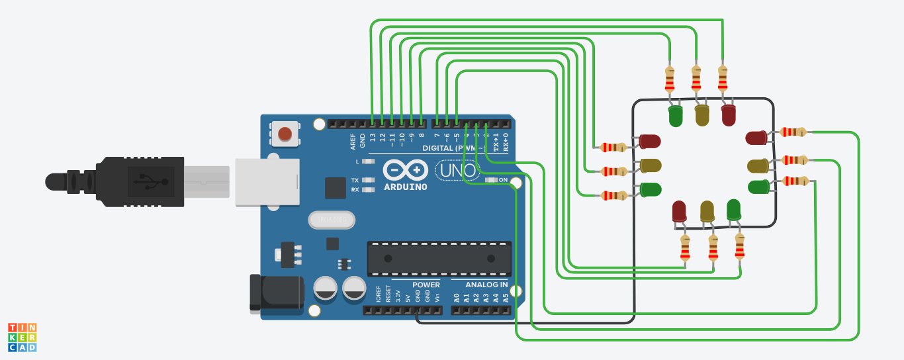

# Arduino Four‑Way Traffic Light Controller 🚦

> A compact, easily‑hackable prototype of a real‑world four‑phase traffic junction. Perfect for demos, workshops, or as the first building block of a smart‑city project.

## 🎥 Live Demo

[▶ View the interactive simulation on Tinkercad]([SIMULATION_LINK](https://www.tinkercad.com/things/dYmwXw7H49P-arduino-4way-traffic-light-controller-))
*(replace `SIMULATION_LINK` with your actual URL)*

---

## 📋 Table of Contents

* [Features](#features)
* [Bill of Materials](#bill-of-materials)
* [Schematic / Wiring](#schematic--wiring)
* [How It Works](#how-it-works)
* [Getting Started](#getting-started)
* [Customizing Timings](#customizing-timings)
* [Roadmap](#roadmap)
* [Contributing](#contributing)
* [License](#license)

## ✨ Features

* Four independent signal heads (Red, Yellow, Green)
* Safety **all‑red** interval between phases
* Adjustable green (default 8 s) and amber (default 2 s) delays
* Neat, modular code — add more signals or sensors in seconds
* Zero extra libraries required — 100 % Arduino core

## 🛠️ Bill of Materials

|        Qty | Component                 | Notes                |
| ---------: | ------------------------- | -------------------- |
|          1 | **Arduino UNO / Nano**    | Any ATmega328P board |
|          4 | Red LED                   | 5 mm or 3 mm         |
|          4 | Yellow LED                | 5 mm or 3 mm         |
|          4 | Green LED                 | 5 mm or 3 mm         |
|         12 | 220 Ω resistor            | Current limiting     |
|          1 | Breadboard + jumper wires | —                    |
| *Optional* | USB power bank            | Portable demo        |

## 📐 Schematic / Wiring

| Signal Head       | Arduino Pins (R,Y,G) |
| ----------------- | -------------------- |
| North (`signal1`) | 13, 12, 11           |
| East (`signal2`)  | 10, 9, 8             |
| South (`signal3`) | 7, 6, 5              |
| West (`signal4`)  | 4, 3, 2              |

> **Tip:** Keep LED cathodes tied to the common GND rail to reduce wiring chaos.



## ⚙️ How It Works

1. **Initialization**: All 12 LED pins are configured as outputs and set LOW.
2. **Main loop**:

   * `setAllRed()` turns every signal red for 0.5 s (clearing the intersection).
   * Current signal’s red turns off, green turns on for `redDelay` ms.
   * Green → yellow for `yellowDelay` ms.
   * Yellow off, red back on.
   * Index `i` increments to serve the next direction.
3. Repeat forever → seamless cyclic traffic flow.

The logic is simple yet mirrors real‑world fixed‑time controllers.

## 🚀 Getting Started

```bash
git clone https://github.com/<your‑username>/traffic‑light‑controller.git
cd traffic‑light‑controller
open traffic_light.ino # or use Arduino IDE
```

1. Wire the LEDs as shown above.
2. Select the correct board/port.
3. Upload and watch the intersection come alive!

## 🛠️ Customizing Timings

Open `traffic_light.ino` and tweak:

```cpp
int redDelay    = 8000; // green duration (ms)
int yellowDelay = 2000; // amber duration (ms)
```

Need an **all‑red overlap**? Change the initial `delay(500)` inside `loop()`.

## 🗺️ Roadmap

* [ ] Add pedestrian push‑button logic
* [ ] Integrate ultrasonic sensors for vehicle detection
* [ ] Wi‑Fi + MQTT dashboard (ESP32)
* [ ] OLED countdown timers

## 🤝 Contributing

Pull requests are welcome! For major changes, please open an issue first to discuss what you would like to change.

## 📄 License

This project is licensed under the MIT License — see the [LICENSE](LICENSE) file for details.

---

## 🙌 Author

Created by **Poriya Anirudhdha**.
